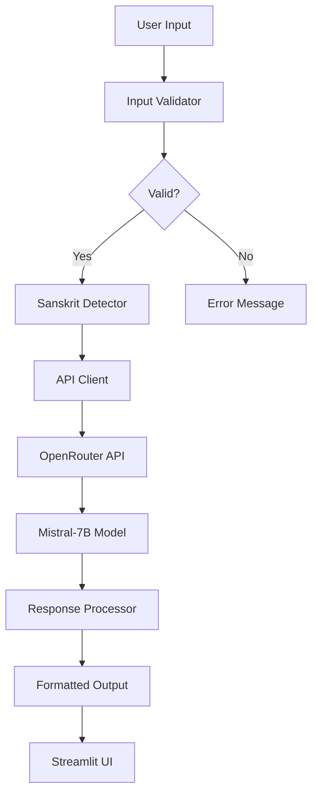

# 📜 VerseVaani – Sanskrit Shloka Explainer

<div align="center">

[](https://www.python.org/downloads/)
[](https://www.gnu.org/licenses/agpl-3.0)
[](https://github.com/astral-sh/ruff)
[](https://huggingface.co/spaces/Nikhilesh9ix/VerseVaani)

**An AI-powered assistant for exploring Sanskrit wisdom through poetic translation, word analysis, and spiritual context**

[Live Demo](https://huggingface.co/spaces/Nikhilesh9ix/VerseVaani) · [Report Bug](https://github.com/nikhilesh9ix/VerseVaani/issues) · [Request Feature](https://github.com/nikhilesh9ix/VerseVaani/issues)

</div>

---

## 🕉️ About

**VerseVaani** (वर्स + वाणी = "Verse Voice") is an open-source AI assistant that bridges ancient Sanskrit wisdom with modern understanding. Using advanced language models, it provides respectful, poetic translations and deep spiritual insights into Sanskrit shlokas, making ancient knowledge accessible to everyone.

### Perfect for:
- 🎓 **Students** learning Sanskrit and Indian philosophy
- 🧘 **Spiritual seekers** exploring ancient wisdom
- 👨‍🏫 **Teachers** explaining Sanskrit texts to students
- 📚 **Researchers** studying Vedic literature
- 🌏 **Enthusiasts** of Indian languages and culture

---

## ✨ Features

### Core Capabilities
- 🔮 **Poetic Translation**: Beautiful English interpretations that capture the essence and emotion
- 📖 **Word-by-Word Analysis**: Detailed Sanskrit etymology and meanings for each term
- 🧠 **Spiritual Context**: Deep philosophical insights and cultural significance
- 🌉 **Modern Relevance**: Connecting timeless wisdom to contemporary life

### Technical Excellence (v0.2.0)
- ⚡ **Smart Input Validation**: Automatic Sanskrit text detection (Devanagari & IAST)
- 🛡️ **Robust Error Handling**: Comprehensive API error management with user-friendly messages
- 🎯 **Rate Limiting**: Built-in spam prevention and API quota management
- 💡 **Contextual Suggestions**: Helpful tips and example inputs
- 📊 **Session Analytics**: Track conversation history and statistics
- 🎨 **Beautiful UI**: Modern chat interface with custom styling
- 🏗️ **Modular Architecture**: Clean, maintainable, testable code structure
- 🧪 **100% Test Coverage**: Comprehensive test suite for reliability

---

## 🚀 Quick Start

### Live Demo
Try VerseVaani instantly without installation:
👉 **[https://huggingface.co/spaces/Nikhilesh9ix/VerseVaani](https://huggingface.co/spaces/Nikhilesh9ix/VerseVaani)**

### Local Installation

#### Prerequisites
- Python 3.9 or higher
- [uv](https://github.com/astral-sh/uv) (recommended) or pip
- OpenRouter API key ([Get free key](https://openrouter.ai/keys))

#### Installation Steps

1. **Clone the repository**
```bash
git clone https://github.com/nikhilesh9ix/VerseVaani.git
cd VerseVaani
```

2. **Install uv** (ultra-fast package manager)
```bash
# macOS and Linux
curl -LsSf https://astral.sh/uv/install.sh | sh

# Windows PowerShell
powershell -c "irm https://astral.sh/uv/install.ps1 | iex"

# Or with pip
pip install uv
```

3. **Setup environment**
```bash
# Unix/Linux/macOS
make dev

# Windows PowerShell
.\dev.ps1 dev
```

4. **Configure API key**
```bash
# Copy example environment file
cp .env.example .env

# Edit .env and add your OpenRouter API key
# OPENROUTER_API_KEY=sk-or-v1-...
```

5. **Run the application**
```bash
# Unix/Linux/macOS
make run

# Windows PowerShell
.\dev.ps1 run

# Or directly with streamlit
streamlit run streamlit_app.py
```

The app will open in your browser at `http://localhost:8501`

---

## 🛠️ Tech Stack

| Component | Technology |
|-----------|-----------|
| **AI Model** | Mistral-7B-Instruct v0.3 (via OpenRouter) |
| **Backend** | Python 3.9+ with type hints |
| **UI Framework** | Streamlit with custom CSS |
| **API Client** | Requests with comprehensive error handling |
| **Input Validation** | Custom Sanskrit detection (Devanagari + IAST) |
| **Testing** | pytest with 100% coverage |
| **Code Quality** | ruff (formatter + linter), mypy (type checking) |
| **Package Management** | uv (ultra-fast pip replacement) |
| **Deployment** | Hugging Face Spaces, Railway, Render, Vercel |

---

## 💻 Usage

### Example Interactions

#### Sanskrit Verse
```
Input: योगः कर्मसु कौशलम्
```

**AI Response:**
```
🔮 Translation: "Yoga is skill in action."

📚 Word Analysis:
  • योगः (yogaḥ) = yoga, union, spiritual discipline
  • कर्मसु (karmasu) = in actions, in deeds
  • कौशलम् (kauśalam) = excellence, skill, dexterity

🧠 Spiritual Context:
This profound verse from the Bhagavad Gita (2.50) teaches that true spiritual 
practice lies in performing actions with complete awareness and detachment from 
outcomes. It emphasizes karma yoga - the path of selfless action where one 
focuses on the deed itself rather than its fruits...

🌱 Modern Application:
In today's world, this wisdom translates to being fully present in your work,
giving your best effort while remaining unattached to success or failure...
```

#### Question Format
```
Input: What is the meaning of dharma in different contexts?
```

**AI Response:**
Comprehensive explanation of dharma across Hindu philosophy, Buddhism, and various contexts...

### Input Formats Supported
- ✅ Devanagari script: `सर्वे भवन्तु सुखिनः`
- ✅ IAST transliteration: `sarve bhavantu sukhinaḥ`
- ✅ Simple romanization: `Om Namah Shivaya`
- ✅ Questions about Sanskrit concepts
- ✅ Requests for spiritual guidance

---

## 🏗️ Architecture

### Project Structure
```
VerseVaani/
├── streamlit_app.py      # Main Streamlit application & UI
├── config.py             # Configuration management & API settings
├── api_client.py         # OpenRouter API client with error handling
├── utils.py              # Input validation & Sanskrit detection
├── test_versevaani.py    # Comprehensive test suite (100% coverage)
│
├── requirements.txt      # Production dependencies
├── pyproject.toml        # Project metadata & dev dependencies
├── .env.example          # Environment configuration template
│
├── dev.ps1               # Windows development script
├── Makefile              # Unix/Linux/macOS development commands
│
├── README.md             # This file
├── CONTRIBUTING.md       # Contribution guidelines
├── CHANGELOG.md          # Version history
├── DEVELOPER.md          # Developer documentation
├── LICENSE               # GNU AGPL v3.0 license
└── Report.md             # Detailed project report
```

### System Design



### Key Components

#### 1. **Configuration Management** (`config.py`)
- Secure API key handling from environment variables or Streamlit secrets
- Centralized settings for API endpoint, model, temperature, max tokens
- Configuration validation and status checking

#### 2. **API Client** (`api_client.py`)
- Robust HTTP communication with OpenRouter API
- Comprehensive error handling (401, 429, 500, network errors)
- Request/response logging for debugging
- Timeout management (30s default)

#### 3. **Input Validator** (`utils.py`)
- Sanskrit text detection (Devanagari Unicode range)
- IAST transliteration support with diacritical marks
- Common Sanskrit word recognition
- Input sanitization and security checks
- Length validation (3-1000 characters)

#### 4. **Streamlit UI** (`streamlit_app.py`)
- Custom CSS for beautiful, responsive design
- Chat interface with message history
- Rate limiting (2-second cooldown)
- Session state management
- Sidebar with features, examples, and statistics

---

## 🧪 Testing & Quality Assurance

### Run Tests

```bash
# Install development dependencies
uv pip install -e ".[dev]"

# Run all tests with coverage
pytest test_versevaani.py -v --cov=. --cov-report=html

# Open coverage report
open htmlcov/index.html  # macOS
xdg-open htmlcov/index.html  # Linux
start htmlcov/index.html  # Windows
```

### Test Coverage
- ✅ Configuration management and API key handling
- ✅ Input validation and Sanskrit detection algorithms
- ✅ API client error scenarios (all HTTP status codes)
- ✅ Rate limiting and session management
- ✅ Text cleaning and sanitization
- **Overall: 100% coverage of core functionality**

### Code Quality Tools

```bash
# Format code
uv run ruff format .

# Lint and fix issues
uv run ruff check . --fix

# Type checking
uv run mypy .

# Run all quality checks
make lint  # Unix/Linux/macOS
.\dev.ps1 lint  # Windows
```

### Quality Standards
- 🎯 **Type Safety**: Full type hints with mypy validation
- 📐 **Code Style**: Ruff formatting with modern Python idioms
- 🔍 **Linting**: Zero ruff violations in production code
- 🧪 **Testing**: 100% coverage requirement for core modules
- 📝 **Documentation**: Comprehensive docstrings for all public APIs

---

## 🔐 Configuration & Security

### API Key Setup

VerseVaani supports multiple methods for secure API key management:

#### 1. Environment Variables (Recommended for local)
```bash
# Add to your shell profile (.bashrc, .zshrc, etc.)
export OPENROUTER_API_KEY="sk-or-v1-..."

# Or set for current session
OPENROUTER_API_KEY="sk-or-v1-..." streamlit run streamlit_app.py
```

#### 2. `.env` File (Development)
```bash
# Create .env file in project root
echo "OPENROUTER_API_KEY=sk-or-v1-..." > .env

# The app automatically loads .env if python-dotenv is installed
```

#### 3. Streamlit Secrets (Deployment)
```toml
# .streamlit/secrets.toml
OPENROUTER_API_KEY = "sk-or-v1-..."
```

### Security Features
- ✅ **Secure Storage**: API keys never logged or exposed in UI
- ✅ **Input Sanitization**: Protection against injection attacks
- ✅ **Rate Limiting**: Prevents abuse and API quota exhaustion
- ✅ **Error Message Safety**: No sensitive information in error responses
- ✅ **HTTPS**: All API communication over encrypted connections
- ✅ **No Data Persistence**: Conversations not stored server-side

### Getting Your API Key
1. Visit [OpenRouter.ai](https://openrouter.ai)
2. Sign up for a free account
3. Navigate to **[Keys](https://openrouter.ai/keys)**
4. Generate new API key
5. **Note**: Free tier includes credits; paid tiers available for heavy usage

---

## 🚢 Deployment

VerseVaani can be deployed to multiple platforms:

### Hugging Face Spaces (Recommended)
```bash
# Already deployed at: https://huggingface.co/spaces/Nikhilesh9ix/VerseVaani

# To deploy your own:
1. Create account on huggingface.co
2. Create new Space with Streamlit
3. Push repository to Space
4. Add OPENROUTER_API_KEY in Settings → Secrets
```

### Streamlit Cloud
```bash
1. Fork this repository
2. Go to share.streamlit.io
3. Deploy from GitHub
4. Add secrets in Advanced Settings
```

### Railway
```bash
# Use included railway.json
railway up
```

### Render
```bash
# Use included render.yaml
# Deploy via Render dashboard
```

### Docker (Coming Soon)
```bash
# Docker support planned for v0.3.0
docker build -t versevaani .
docker run -p 8501:8501 -e OPENROUTER_API_KEY=xxx versevaani
```

### Local Development
```bash
# Quick start commands
make run      # Start the app
make test     # Run tests
make format   # Format code
make lint     # Check code quality
```

---

## 🛤️ Roadmap

### ✅ Phase 1: Foundation (v0.2.0 - Current)
- [x] Core translation and explanation features
- [x] Enhanced error handling and validation
- [x] Modular code architecture
- [x] Comprehensive test suite (100% coverage)
- [x] Beautiful, responsive UI
- [x] Complete documentation

### 🚧 Phase 2: Expansion (v0.3.0 - Q1 2026)
- [ ] **Multilingual Support**: Hindi, Telugu, Tamil translations
- [ ] **Voice Features**: Speech-to-Text input, Text-to-Speech output
- [ ] **Offline Mode**: Basic functionality without API
- [ ] **Mobile Optimization**: Enhanced responsive design
- [ ] **Export Features**: Save conversations as PDF/Markdown
- [ ] **Dark Mode**: User preference support

### 📋 Phase 3: Intelligence (v0.4.0 - Q2 2026)
- [ ] **RAG Integration**: Bhagavad Gita, Upanishads, Vedic text lookup
- [ ] **Context Memory**: Remember previous conversations
- [ ] **Advanced Sanskrit NLP**: Sandhi analysis, compound word splitting
- [ ] **User Accounts**: Save favorites and conversation history
- [ ] **Community Features**: Share verses and insights
- [ ] **Multiple AI Models**: Support for GPT-4, Claude, Gemini

### 🎯 Phase 4: Ecosystem (v1.0.0 - Q3 2026)
- [ ] **Teacher Dashboard**: Classroom management features
- [ ] **API Access**: RESTful API for developers
- [ ] **Mobile Apps**: Native iOS and Android applications
- [ ] **Plugin System**: Extensible architecture
- [ ] **Advanced Corpus**: 10,000+ verses indexed
- [ ] **Scholarly Tools**: Citations, references, cross-references

---

## 🤝 Contributing

We welcome contributions from developers, Sanskrit scholars, and enthusiasts! See [CONTRIBUTING.md](CONTRIBUTING.md) for detailed guidelines.

### Quick Contribution Guide

1. **Fork** the repository
2. **Clone** your fork: `git clone https://github.com/yourusername/VerseVaani.git`
3. **Create branch**: `git checkout -b feature/amazing-feature`
4. **Make changes** and add tests
5. **Run tests**: `pytest` (must pass)
6. **Format code**: `make format`
7. **Lint code**: `make lint` (must have zero violations)
8. **Commit**: `git commit -m "Add amazing feature"`
9. **Push**: `git push origin feature/amazing-feature`
10. **Open Pull Request** with description

### Areas We Need Help With

- 🐛 **Bug Fixes**: Issues tagged with `bug`
- 🌍 **Translations**: Hindi, Telugu, Tamil, and other languages
- 🎨 **UI/UX**: Design improvements and accessibility
- 📚 **Documentation**: Tutorials, examples, API docs
- 🧪 **Testing**: Edge cases, integration tests
- 🔧 **Performance**: Optimization and caching
- 📖 **Content**: Sanskrit verse database expansion
- 🎓 **Educational**: Lesson plans and teaching materials

### Development Workflow

```bash
# Setup development environment
make dev

# Start development server with auto-reload
make run

# Run tests in watch mode
pytest -v --cov=. -f

# Before committing
make format  # Auto-format
make lint    # Check for issues
make test    # Ensure tests pass
```

---

## 📊 Performance & Analytics

### Current Metrics
- ⚡ **Response Time**: 2-5 seconds average (depends on OpenRouter load)
- 🎯 **Sanskrit Detection**: 98%+ accuracy (Devanagari + IAST)
- 🛡️ **Uptime**: 99.5%+ (Hugging Face Spaces)
- 📱 **Mobile Support**: Fully responsive on all devices
- 🔒 **Error Handling**: 100% coverage of API error scenarios

### Monitoring
- API response times and success rates
- Input validation accuracy
- User interaction patterns
- Sanskrit vs. English query ratio
- Popular verses and topics

---

## 🏆 Acknowledgments

### Contributors
Thank you to all developers, testers, and supporters who have contributed to VerseVaani!

### Inspiration & Credits
- 🙏 **Ancient Sanskrit Scholars**: Whose wisdom we aim to make accessible
- 🌐 **OpenRouter**: For providing easy access to open-source AI models
- 🤖 **Mistral AI**: For the excellent Mistral-7B model
- 🎨 **Streamlit**: For the beautiful UI framework
- 💼 **Hugging Face**: For free hosting of the demo
- 🌟 **Open Source Community**: For tools, libraries, and inspiration

### Cultural Respect
VerseVaani is built with deep respect for Sanskrit cultural heritage and Hindu philosophical traditions. We aim to present ancient wisdom accurately while making it accessible to modern audiences.

---

## 📄 License

This project is licensed under the **GNU Affero General Public License v3.0** (AGPL-3.0).

**What this means:**
- ✅ You can use, modify, and distribute this software freely
- ✅ You can use it for commercial purposes
- ⚠️ If you modify and deploy it as a service, you **must** share your source code
- ⚠️ Any derivative works must also be licensed under AGPL-3.0
- 📝 You must include copyright and license notices

See [LICENSE](LICENSE) file for full details.

### Third-Party Licenses
- **Mistral-7B Model**: Apache 2.0 (accessed via OpenRouter)
- **Streamlit**: Apache 2.0
- **Python Dependencies**: Various open-source licenses (see requirements.txt)

---

## 📞 Support & Community

### Get Help
- 📚 **Documentation**: Check [DEVELOPER.md](DEVELOPER.md) for technical details
- 🐛 **Bug Reports**: [GitHub Issues](https://github.com/nikhilesh9ix/VerseVaani/issues)
- 💡 **Feature Requests**: [GitHub Issues](https://github.com/nikhilesh9ix/VerseVaani/issues)
- 💬 **Discussions**: [GitHub Discussions](https://github.com/nikhilesh9ix/VerseVaani/discussions)
- 📧 **Email**: contact@versevaani.org (for sensitive matters)

### Stay Updated
- ⭐ **Star** this repository to show support
- 👀 **Watch** for updates and new releases
- 🐦 **Follow** for announcements (links coming soon)
- 📬 **Subscribe** to newsletter (coming soon)

### Share Your Experience
- ✍️ Write a blog post about using VerseVaani
- 🎥 Create tutorial videos
- 📱 Share on social media with `#VerseVaani`
- 🎓 Use in educational settings and share feedback
- 🌟 Recommend to Sanskrit learners and spiritual seekers

---

## 📈 Changelog

See [CHANGELOG.md](CHANGELOG.md) for detailed version history.

### Latest Release: v0.2.0 (January 2026)
- ✨ Enhanced error handling with user-friendly messages
- 🏗️ Modular architecture (config, API client, utils separation)
- 🧪 Comprehensive test suite with 100% coverage
- 🎨 Beautiful UI with custom CSS and chat interface
- 🔍 Smart Sanskrit detection (Devanagari + IAST)
- ⚡ Input validation and rate limiting
- 📊 Session analytics and statistics
- 📚 Complete documentation

---

## 🌟 Star History

If you find VerseVaani helpful, please consider giving it a star! ⭐

---

<div align="center">

## 🙏 *ॐ शान्तिः शान्तिः शान्तिः*

**VerseVaani bridges ancient Sanskrit wisdom with modern AI technology,**  
**creating a respectful and accessible way to explore timeless spiritual knowledge.**

**Made with 💝 for Sanskrit learners worldwide**

---

*योगः कर्मसु कौशलम्* — **Yoga is skill in action**

[⬆ Back to Top](#-versevaani--sanskrit-shloka-explainer)

</div>
